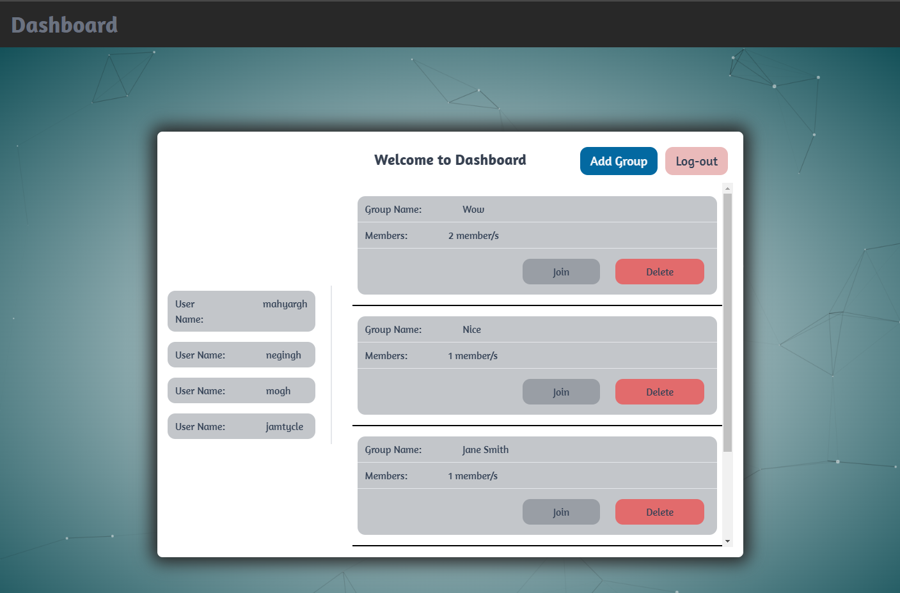

# ChatApp

This is a chat application project developed for a lab test. The application allows users to communicate in real-time within designated chat rooms.

## Images





## Table of Contents

- [Installation](#installation)
- [Images](#Images)
- [Features](#Features)

## Features

1. **User Authentication**:
   - New users can sign up with a unique username.
   - Existing users can log in securely using their credentials.

2. **Room Selection**:
   - Users can choose to join different chat rooms based on their interests.
   - Available rooms include devops, cloud computing, covid19, sports, nodeJS, etc.

3. **Real-time Chat**:
   - Users can engage in real-time conversations with other users within the same room.

4. **Typing Indicator**:
   - Displays "user is typing..." notifications when someone is composing a message.

5. **User-friendly Interface**:
   - The application provides an intuitive and responsive interface for seamless user interaction.

6. **Data Persistence**:
   - User details and chat messages are stored securely in a MongoDB database for future retrieval.

7. **Session Management**:
   - The application manages user sessions using localStorage to maintain login states.

8. **Logout Functionality**:
   - Users can safely log out from their accounts to end their session.


## Installation

Instructions for installing the project.

```bash
npm install
# Back-end ---> npm run dev.
# Front-end ---> yarn start or npm start
```

## Note

- You have to connect it to your own database. So use your own Connection String.
- Change the ports if needed.


